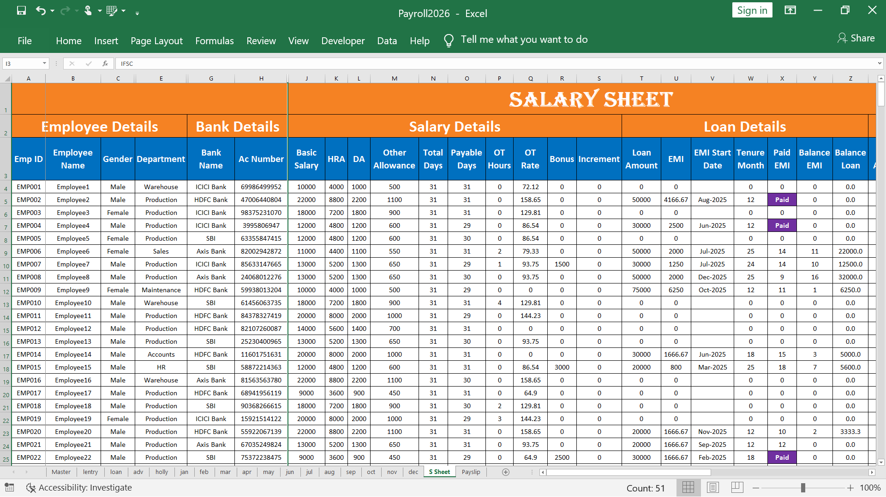
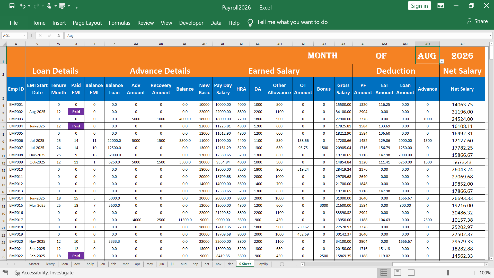
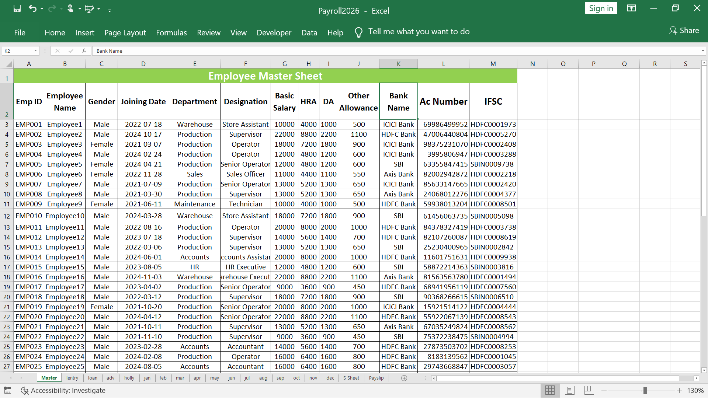
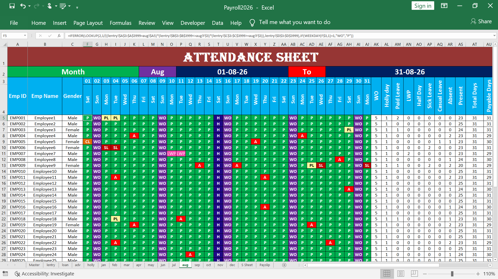
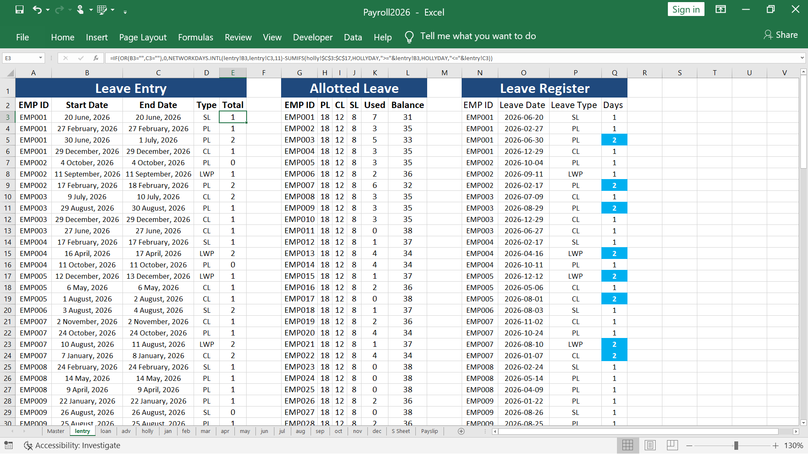
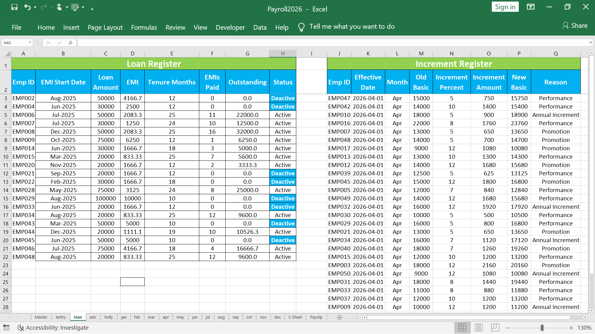
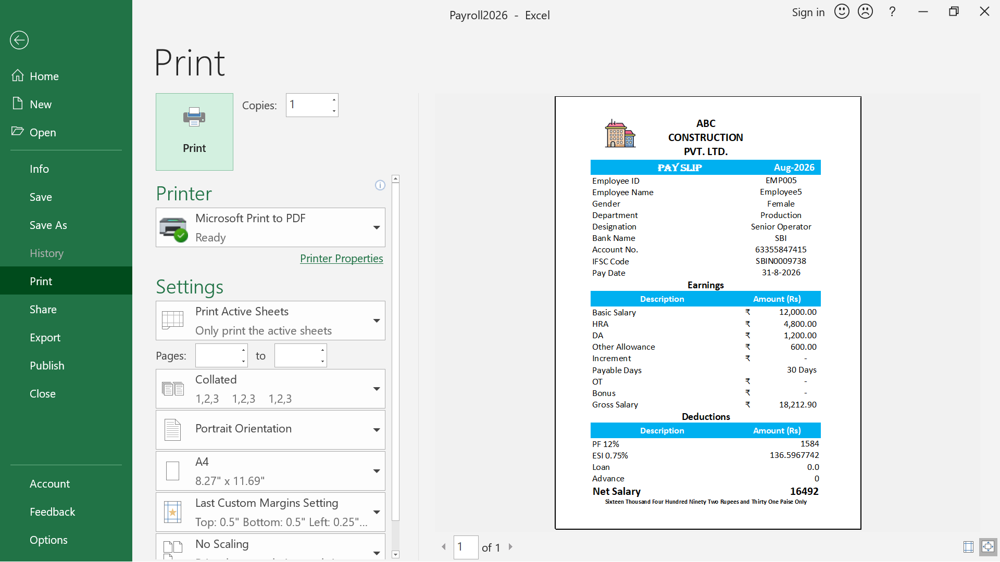
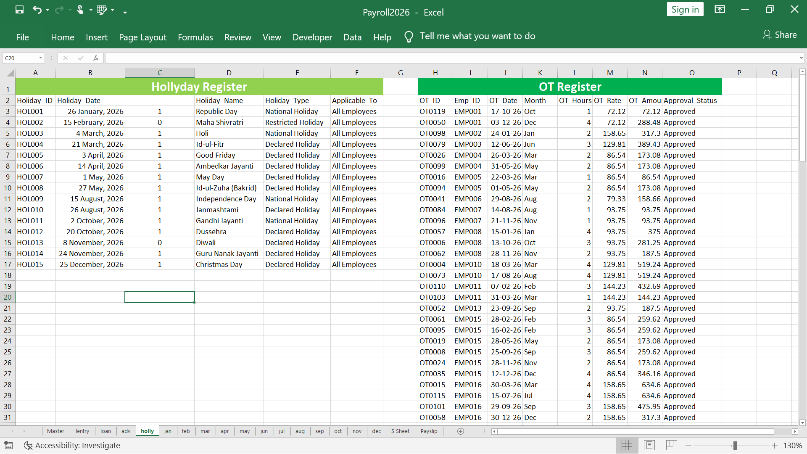
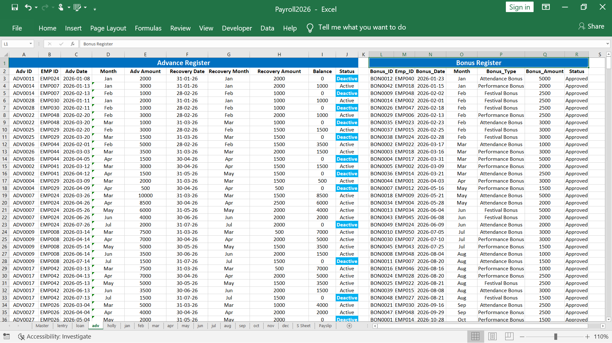

# Payroll-Management-System
50 Employee Automated Payroll Management System in Microsoft Excel
# Automated Payroll Management System – Microsoft Excel

## 📌 Project Overview

This project is a 50-employee Automated Payroll Management System developed in Microsoft Excel.

The system integrates employee information, attendance, leave, overtime, bonus, increment, advance salary and loan details with monthly salary calculations.

## ⚙️ Key Features

- Employee Master Management
- Monthly Attendance Management
- Leave Register
- Overtime (OT) Management
- Bonus Management
- Increment Management
- Advance Salary Management
- Loan & EMI Management
- Automated Monthly Salary Calculation
- Automated Payslip Generation
- Employee and Month-based Drop-down Selection
- Automatic Salary Deductions
- Loan EMI tracking and balance calculation

## 📊 Payroll Automation

The registers are linked with the Salary Sheet.

Leave, overtime, bonus, increment, advance salary and loan EMI details automatically reflect in the monthly salary calculation.

Loan deductions automatically stop after the loan is fully recovered.

## 🛠️ Excel Skills Used

- Advanced Excel
- VLOOKUP
- SUMIFS
- COUNTIFS
- IF / IFS
- Pivot Tables
- Data Validation
- Drop-down Lists
- Excel Formulas
- Worksheet Linking
- Payroll Automation

## 📁 Project Modules

1. Employee Master
2. Attendance Sheet
3. Leave Register
4. Overtime Register
5. Bonus Register
6. Increment Register
7. Advance Salary Register
8. Loan Register
9. Salary Sheet
10. Automated Payslip

## 👥 Project Size

**50 Employees | Monthly Payroll | Sample Data**

## 🎯 Objective

The objective of this project is to reduce manual payroll work, improve salary calculation accuracy and create an organized Excel-based payroll management system.

## 📥 Payroll Excel File

[Download Automated Payroll Management System](.Payroll2026.xlsm)

## 📷 Screenshots

### Salary Sheet

### Employee Master

### Attendance

### Leave Register

### Loan Automation

### Automated Payslip

### Hollyday Register

### Advance Register 

## 📞 Connect With Me

- 🌐 **Portfolio:** [My Portfolio](https://pradeepkurrey.github.io/My-Website/)
- 💼 **LinkedIn:** [My LinkedIn Profile](https://www.linkedin.com/in/pradeep-kurrey-data-analyst/)
